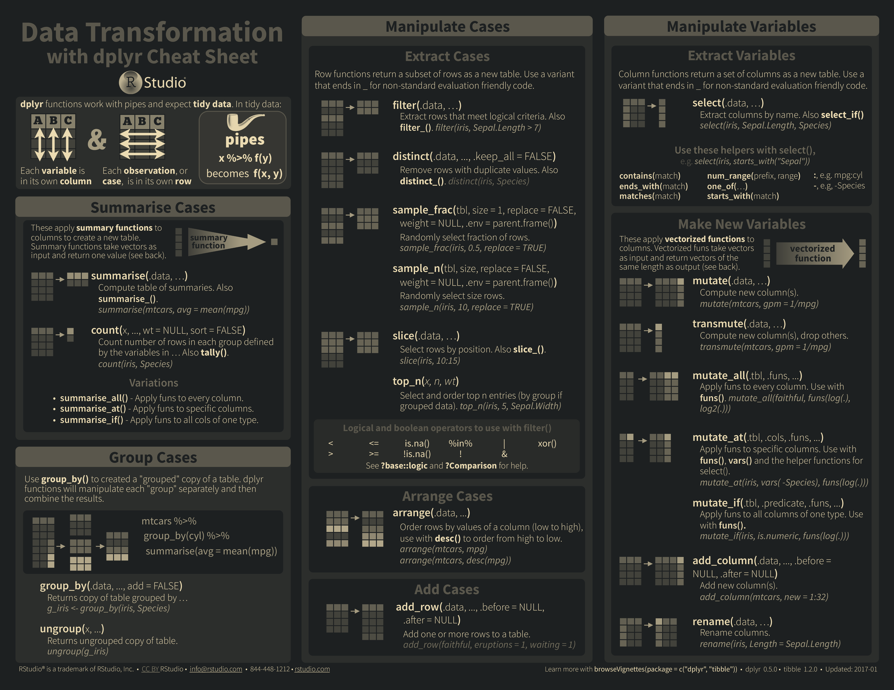
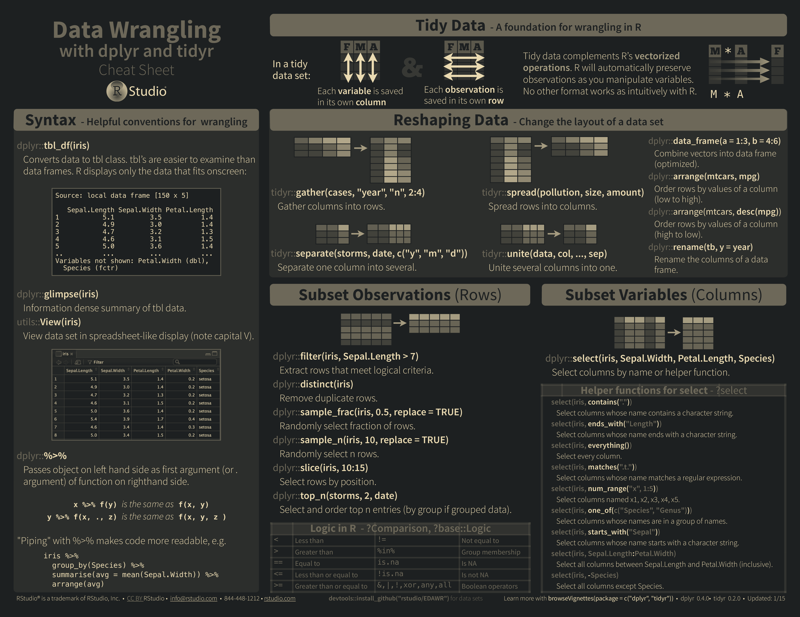
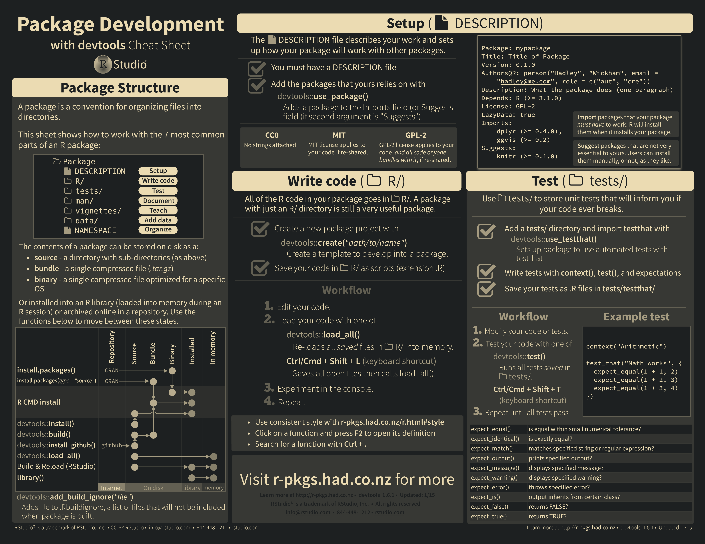
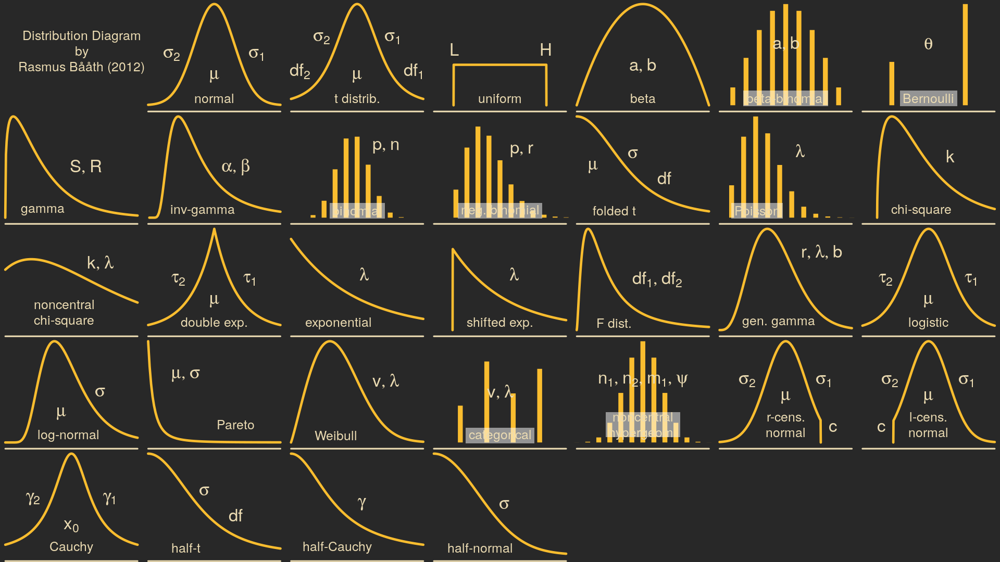

# cheatsheet wallpapers

Conventions:

- Each folder contains an independent set of cheatsheet sources, makefiles, and instructions.
- Sources of the source/material/asset files are usually listed in `SOURCE`
- Original documents (e.g. `README.md`, `Makefile`) are renamed with a `_orig` suffix.

## showcases

Python data science [cheatsheets](https://www.datacamp.com/community/tutorials/python-data-science-cheat-sheet-basics)

RStudio [cheatsheets](https://github.com/rstudio/cheatsheets)

Distribution diagrams by [Rasmus Baath](https://github.com/rasmusab/distribution_diagrams)

