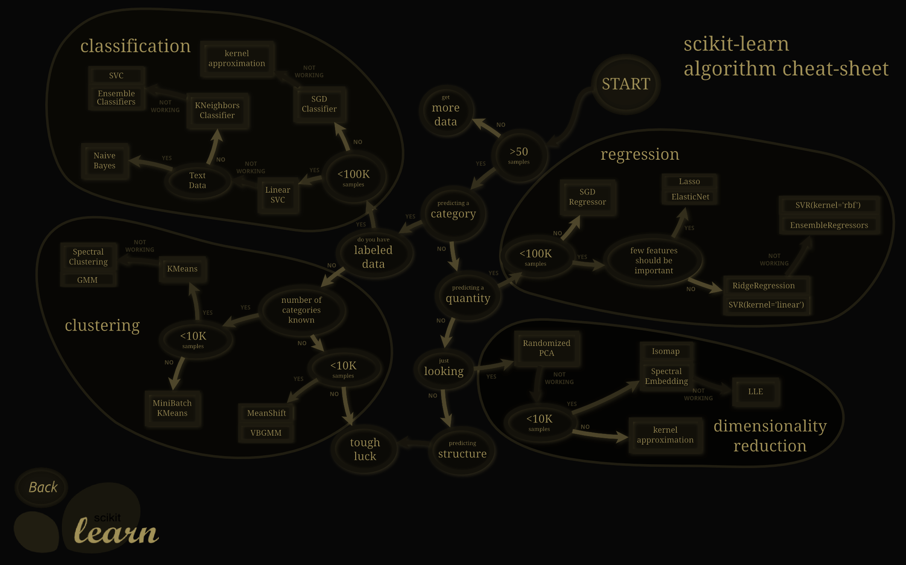
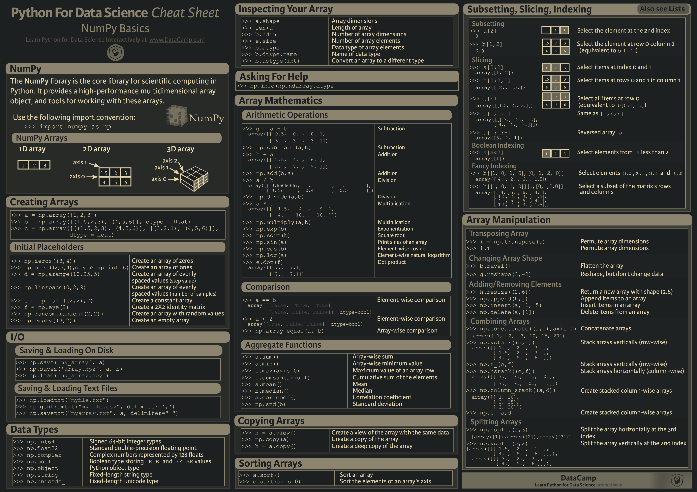
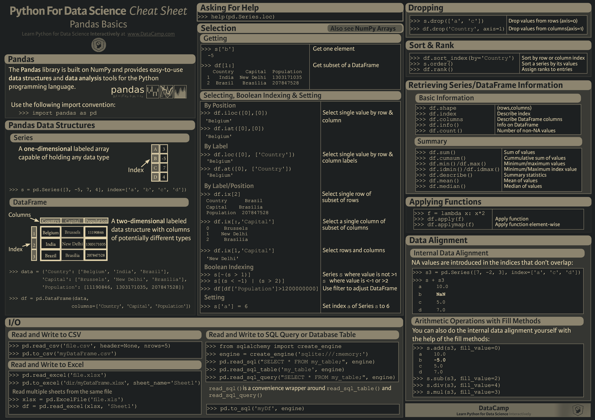
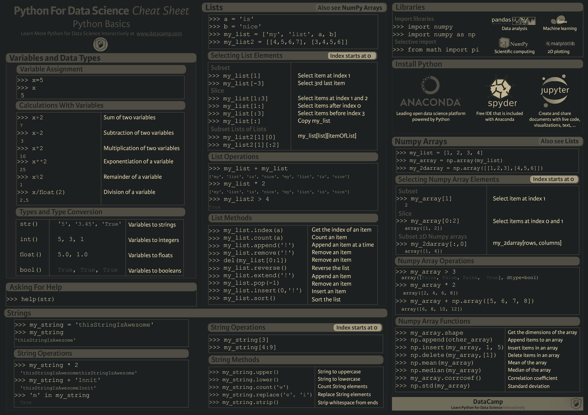
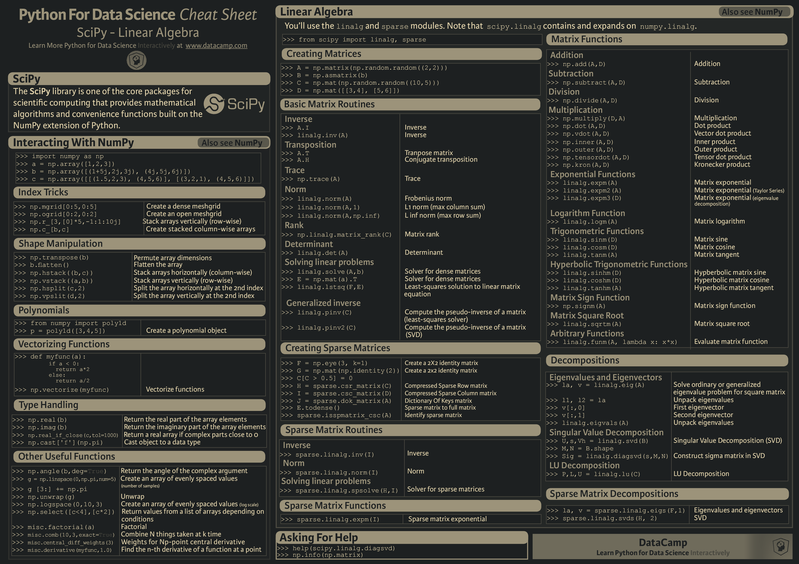
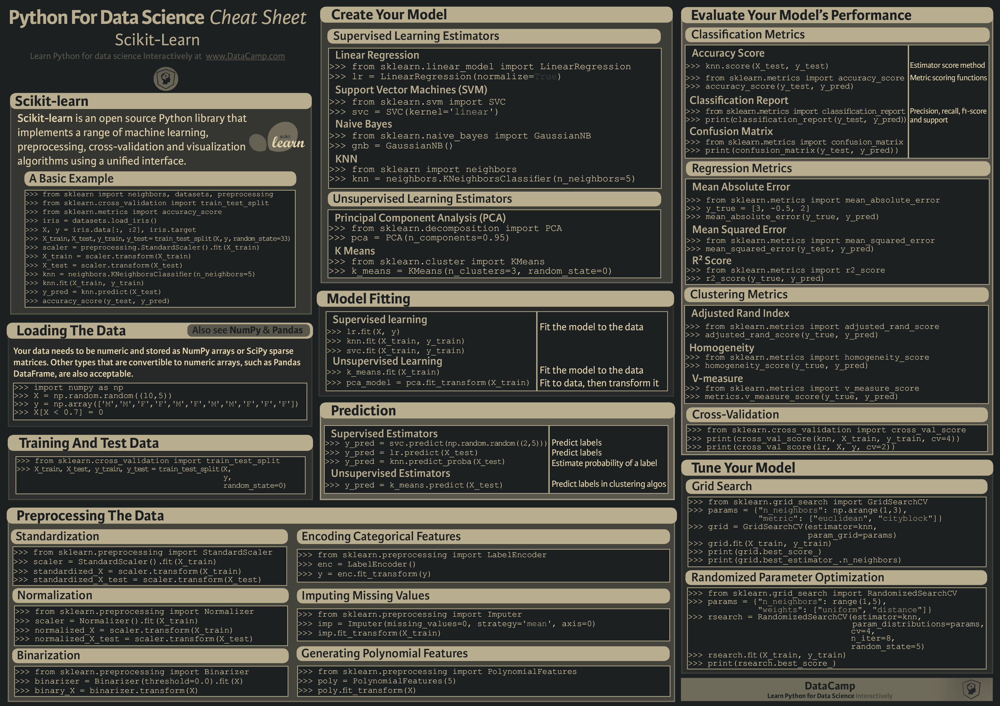

# cheatsheet wallpapers

Directories:

- `converted`: wallpapers converted from `.pdf` or other formats, using `convert` from `imagemagick`.
- `compiled_by_others`: wallpapers compiled from source files (`.tex`, `.md`) collected from Internet.
- `compiled_by_self`: wallpapers compiled from source files written by myself.

Conventions:

- sources of the source/material/asset files are usually listed in `SOURCE`
- original documents (e.g. `README.md`, `Makefile`) are renamed with a `_orig` suffix.

## showcases

